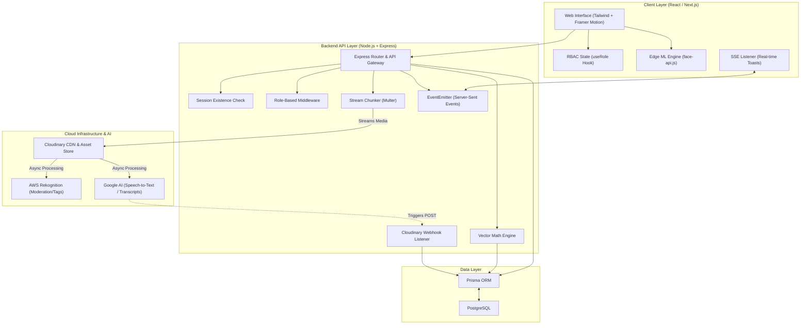
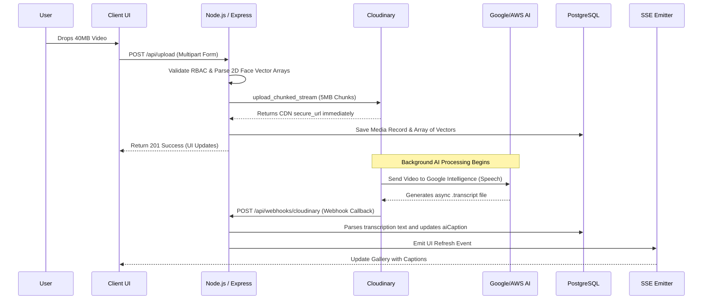
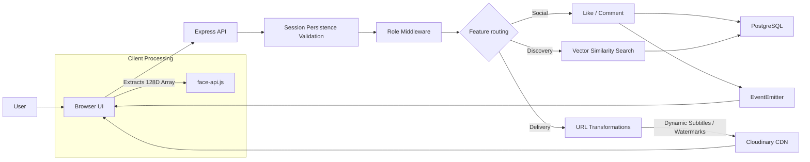

# Architecture Diagram

This document outlines the architecture, data flows, and infrastructure design for the **Event & Media Management Platform**. The system is built as a decoupled, full-stack SaaS application emphasizing scalable cloud storage, real-time event-driven interactions, and AI processing.

## System Architecture

## Smart Upload & AI Processing Pipeline

## Core Request & Data Flow

## Role-Based Access Control (RBAC) Matrix

| Role | Capabilities |
| --- | --- |
| Admin | Create/edit events, manage metadata, change user roles globally, full access to all private and public media, moderate interactions. |
| Photographer | Upload media in bulk, delete media, bypass public/private restrictions, view assigned private albums, auto apply watermarks. |
| Club Member | View club-only private albums, interact socially, upload media, delete media, use "Find My Photos" AI search. |
| Viewer | Default tier. View public albums only, share public links, download strictly watermarked media. |
