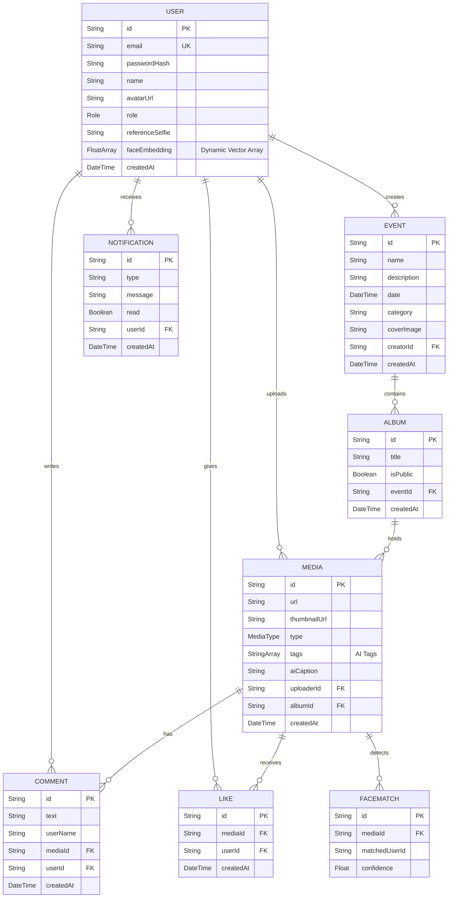

# Database Schema 

This document outlines the PostgreSQL database schema for the **EventLens Platform**, managed via the **Prisma ORM**. The schema is designed to support scalable media storage, Role-Based Access Control (RBAC), Social Interactions, and AI-powered workflows (Facial Recognition & Auto-Captioning).

## Entity Relationship Diagram (ERD) 



## Core Tables

| Table | Purpose |
| --- | --- |
| `User` | Stores account identity, RBAC roles, and authorization credentials. Includes array of face embeddings for optimized Similarity matching. |
| `Event` | A workspace container storing event metadata such as name, description, date, and category. |
| `Album` | Event-wise album container with Public/Private toggles to restrict access for unauthenticated viewers. |
| `Media` | Stores asset URLs, optimization thumbnails, media types, AI-generated captions, and AI tags. |
| `FaceMatch` | Caches AI facial recognition hits and confidence scores to prevent recalculation. |
| `Comment` | Social comment records containing the username for immediate, join-free UI rendering. |
| `Like` | Social interaction tracking with strict constraints to prevent duplicate likes from the same user. |
| `Notification` | Real-time notification records for likes, comments, tags, uploads, and album updates. |

## Enums

```prisma
enum Role {
  ADMIN
  PHOTOGRAPHER
  CLUB_MEMBER
  VIEWER
}

enum MediaType {
  IMAGE
  VIDEO
}
```

Find the source Prisma schema at: [`backend/prisma/schema.prisma`](./backend/prisma/schema.prisma).
